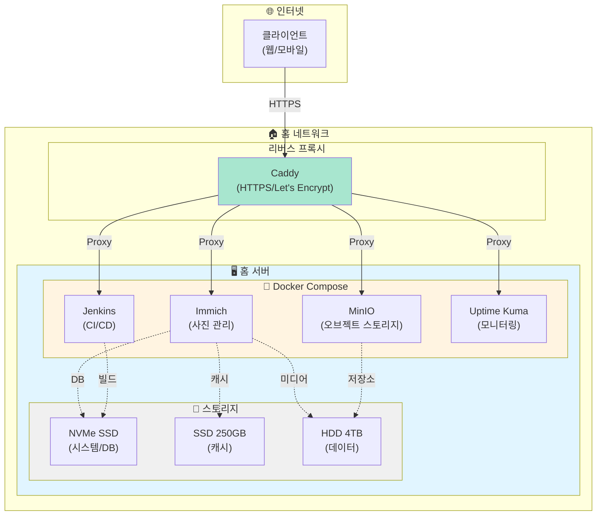

# 👋 안녕하세요!

## 📌 개인 소개

- 🎓 **이름**: 김지훈 (KIM JIHOON)
- 💼 **직무**: Backend Developer
- 📧 **이메일**: shaul1991@gmail.com
- 🔗 **GitHub**: <a href="https://github.com/shaul1991" target="_blank">github.com/shaul1991</a>

### 관심 분야
- 🖥️ 백엔드 개발
- 🏠 홈 서버 구축 및 운영
- 📚 지속적인 학습과 성장

---

## 🏠 홈 서버 사이드 프로젝트

### 운영 중인 Self-Hosted 서비스

- **Immich** - 사진/동영상 백업 및 관리
- **MinIO** - S3 호환 오브젝트 스토리지
- **Jenkins** - CI/CD 자동화
- **Uptime Kuma** - 서비스 모니터링

### 인프라 구성도

---

## 📚 기술 영역별 학습 진행 상황

### Backend
- **Python** ████████░░ 80%
  - Django, FastAPI, Flask
  - 비동기 프로그래밍
  - 데이터 처리 및 분석

- **Java** ██████░░░░ 60%
  - Spring Boot, Spring Framework
  - JPA, MyBatis
  - 객체지향 설계

- **Node.js** ███████░░░ 70%
  - Express, NestJS
  - REST API 개발
  - 실시간 통신 (WebSocket)

### DevOps & Infrastructure
- **Docker** ████████░░ 80%
  - 컨테이너화, Docker Compose
  - 멀티 스테이지 빌드

- **Kubernetes** ████░░░░░░ 40%
  - 기본 개념 학습 중
  - 배포 및 오케스트레이션

- **Linux** █████████░ 90%
  - 시스템 관리, 쉘 스크립팅
  - 네트워크 설정

### Database
- **MySQL/PostgreSQL** ███████░░░ 70%
  - 쿼리 최적화
  - 인덱싱, 트랜잭션

- **MongoDB** █████░░░░░ 50%
  - NoSQL 기본 개념
  - CRUD 작업
