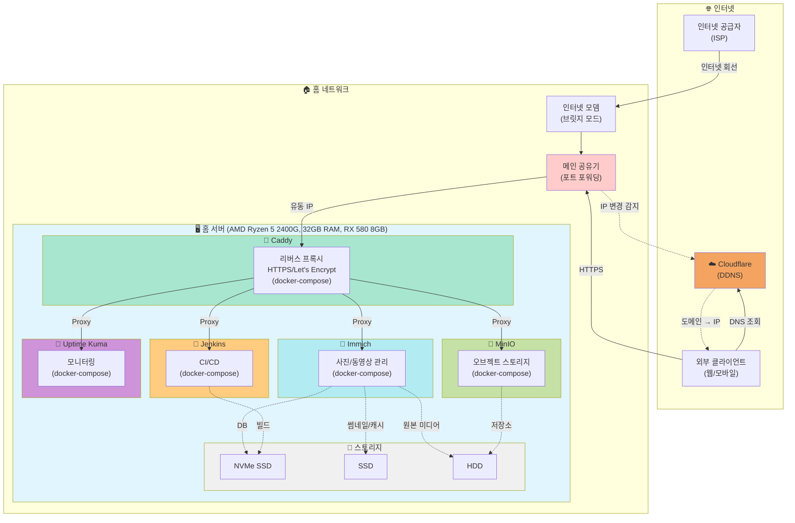

# 🏠 홈 서버 사이드 프로젝트

## 운영 중인 Self-Hosted 서비스

- **Caddy** - 리버스 프록시 / HTTPS 자동화
- **Immich** - 사진/동영상 백업 및 관리
- **MinIO** - S3 호환 오브젝트 스토리지
- **Jenkins** - CI/CD 자동화
- **Uptime Kuma** - 서비스 모니터링

## 인프라 구성도

## 하드웨어 사양

### 💻 시스템 구성

- **CPU**: AMD Ryzen 5 2400G (8 threads) @ 3.600GHz
- **GPU**: AMD ATI Radeon RX 580 8GB OC
- **메모리**: 32GB RAM
- **OS**: Ubuntu 24.04.3 LTS x86_64
- **커널**: 6.8.0-90-generic

### 💾 스토리지 계층

- **NVMe SSD**: 시스템, 데이터베이스, 빌드 캐시
- **SSD**: Immich 썸네일 및 캐시
- **HDD**: Immich 원본 미디어, MinIO 오브젝트 스토리지

## 네트워크 구성

### 외부 접속 흐름

1. **ISP** → 인터넷 공급자로부터 회선 제공
2. **인터넷 모뎀** (브릿지 모드) → 단순 회선 연결
3. **메인 공유기** → 포트 포워딩 설정
4. **Cloudflare DDNS** → 유동 IP 변경 자동 감지 및 DNS 업데이트
5. **Caddy** → HTTPS 리버스 프록시, Let's Encrypt 자동 인증서
6. **Docker 서비스들** → 각 서비스별 독립적인 docker-compose 구성
